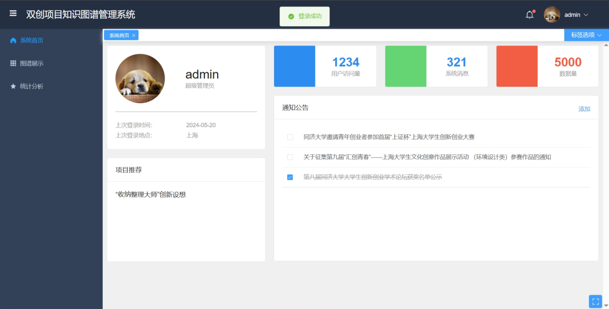
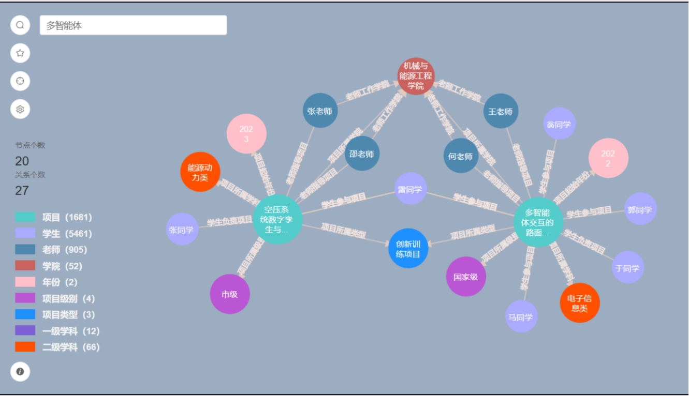
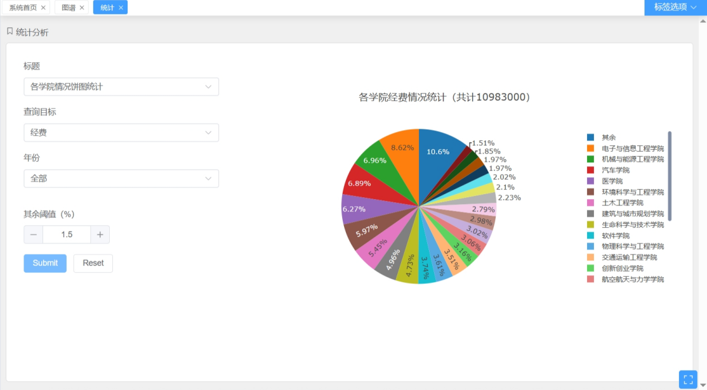

# Knowledge-Graph-System

### 课题介绍

本课题旨在利用知识图谱、自然语言处理等技术，优化传统项目管理方式，并提供了一套前后端系统便利化项目数据可视化与统计分析，有着较高的定制化。

系统架构及技术框架：


### 效果展示

- 系统首页



- 知识图谱可视化



- 统计分析可视化



### 运行方式

```
# 环境：python 3.9.16, neo4j, flask, vue

# 数据预处理(提供了两条测试数据)
python data/xls2csv.py
# 构建知识图谱
python build_projectgraph.py
python build_projectgraph_emb.py(带有项目简介embedding)

# 启动neo4j图数据库
neo4j.bat console
# 启动后端
python server.py
# 启动前端
npm install (首次需要先安装依赖)
npm run serve
```

### 版本迭代

Update 2024.6.12 —— 毕业答辩

功能描述：

- 使用Neo4j图数据库存储知识图谱，使用Flask+Vue框架搭建完整的前后端分离的交互系统
- 使用D3.js绘制知识图谱矢量图（力导向图），支持查看属性、展开节点、隐藏节点、拖拽节点等操作
- 支持多样化数据检索方式，包括节点关联图查询、基于节点类型的查询、基于关键词的查询、（基于词嵌入）相似项目的推理查询等方式
- 使用Plotly.js绘制统计分析结果，包括饼图、折线图、柱状图

### 鸣谢

本系统构建过程中使用到了科大讯飞关键词提取API、百度智能云大模型API、TexSmart文本匹配API，在此感谢！
